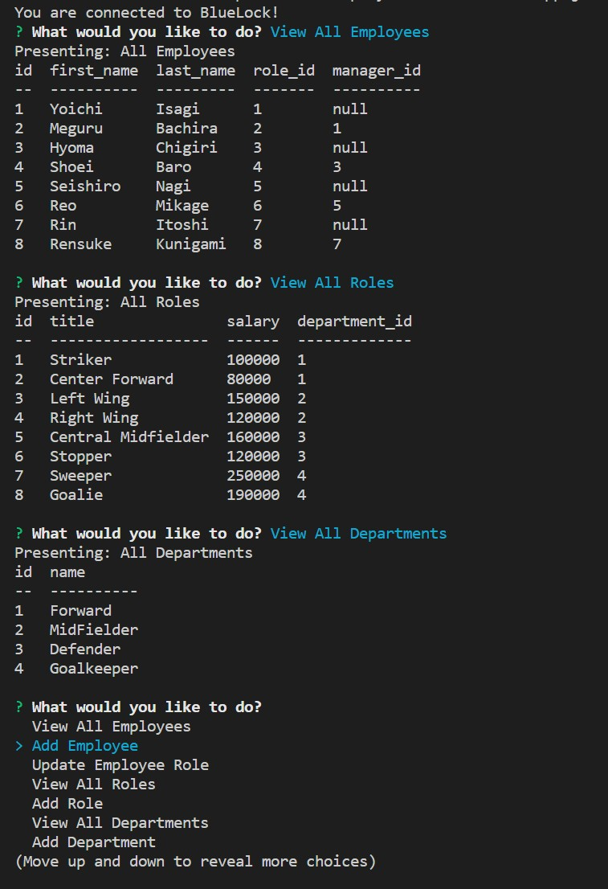

# Employee-Tracker
Module 12: Command line application that used mySQL to manage a company's employees in a database. 

## Installation
1. Clone the repository
2. Install Node.js to your pc
3. Within the command line/terminal, run npm install

## Usage 
* The purpose of this command line application is to use mySQL to create a database for managing a company's employees. 
* After the user follows the command line prompts using Node.js, they are able to add employees, add roles, add departments, or update a selected employee's role within their department. 
* This type of app can be useful for growing companies. When an employee moves up in position, they can use this type of program to quickly make changes to their roster

*Demonstration [Video of the application](https://watch.screencastify.com/v/eMAOCQZmIB6VjvnjnHbp)

## Credits
Thank you to AskBCS for solving my many SQL syntax errors!

## Contact
[Terri Mack](https://github.com/terrinmack?tab=repositories)
